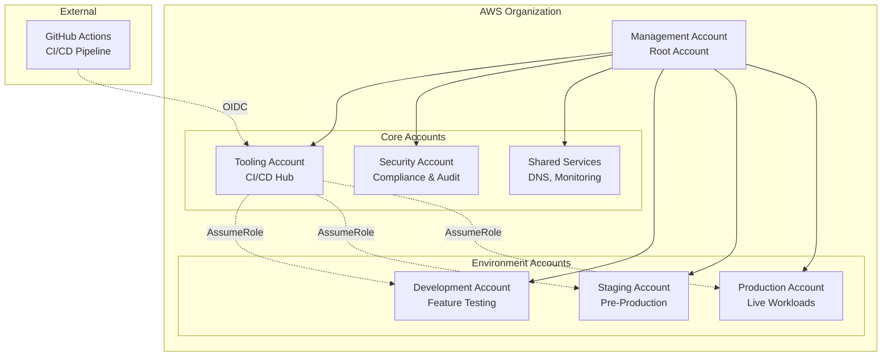
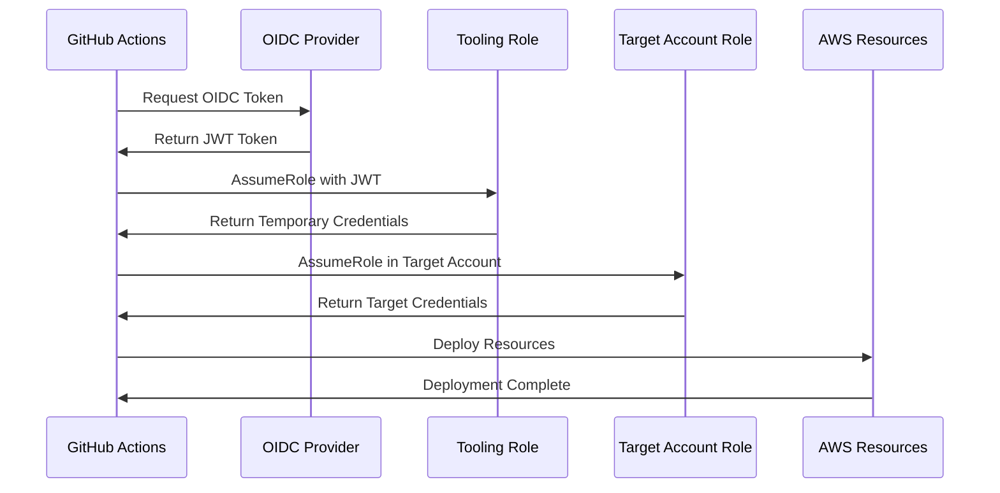

# Cross-Account Architecture Guide

## Overview

The Lattice AWS CDK library provides enterprise-grade cross-account deployment capabilities that enable secure, scalable, and compliant multi-account AWS architectures. This guide covers the implementation, configuration, and best practices for cross-account deployments.

## Architecture Components

### 1. Account Structure



### 2. Authentication Flow



## Implementation Guide

### Step 1: Account Setup

1. **Create AWS Accounts**
   ```bash
   # Use AWS Organizations to create accounts
   aws organizations create-account --email tooling@company.com --account-name "Lattice Tooling"
   aws organizations create-account --email dev@company.com --account-name "Lattice Development"
   aws organizations create-account --email staging@company.com --account-name "Lattice Staging"
   aws organizations create-account --email prod@company.com --account-name "Lattice Production"
   ```

2. **Configure Account Structure**
   ```typescript
   const crossAccountConfig: CrossAccountConfig = {
     githubRepository: 'your-org/your-repo',
     organizationId: 'o-1234567890',
     accounts: {
       tooling: {
         accountId: 'YOUR_TOOLING_ACCOUNT_ID',
         alias: 'lattice-tooling',
         environment: 'tooling',
         // ... configuration
       },
       // ... other accounts
     }
   };
   ```

### Step 2: OIDC Provider Setup

1. **Deploy Tooling Account Infrastructure**
   ```bash
   # Deploy to tooling account
   npx cdk deploy LatticeToolingAccount \
     --profile tooling-account \
     --context environment=tooling
   ```

2. **Configure GitHub Repository Settings**
   - Add repository secrets for account IDs
   - Configure environment protection rules
   - Set up required reviewers for production

### Step 3: Target Account Configuration

1. **Bootstrap Target Accounts**
   ```bash
   # Bootstrap each target account
   npx cdk bootstrap aws://DEV-ACCOUNT-ID/us-east-1 \
     --trust TOOLING-ACCOUNT-ID \
     --cloudformation-execution-policies arn:aws:iam::aws:policy/AdministratorAccess
   
   npx cdk bootstrap aws://STAGING-ACCOUNT-ID/us-east-1 \
     --trust TOOLING-ACCOUNT-ID \
     --cloudformation-execution-policies arn:aws:iam::aws:policy/AdministratorAccess
   
   npx cdk bootstrap aws://PROD-ACCOUNT-ID/us-east-1 \
     --trust TOOLING-ACCOUNT-ID \
     --cloudformation-execution-policies arn:aws:iam::aws:policy/AdministratorAccess
   ```

2. **Deploy Target Account Roles**
   ```bash
   # Deploy deployment roles to each target account
   npx cdk deploy LatticeTargetAccount-dev --profile dev-account
   npx cdk deploy LatticeTargetAccount-staging --profile staging-account
   npx cdk deploy LatticeTargetAccount-prod --profile prod-account
   ```

## Security Model

### 1. Authentication & Authorization

- **OIDC-based Authentication**: No long-lived credentials
- **Temporary Credentials**: 1-2 hour expiration
- **Least Privilege**: Minimal required permissions
- **Account Isolation**: Complete separation between environments

### 2. Trust Relationships

```json
{
  "Version": "2012-10-17",
  "Statement": [
    {
      "Effect": "Allow",
      "Principal": {
        "AWS": "arn:aws:iam::TOOLING-ACCOUNT:role/LatticeGitHubActions"
      },
      "Action": "sts:AssumeRole",
      "Condition": {
        "StringEquals": {
          "aws:PrincipalOrgID": "o-1234567890"
        },
        "StringLike": {
          "aws:userid": "AIDACKCEVSQ6C2EXAMPLE:github-*"
        }
      }
    }
  ]
}
```

### 3. Security Controls

- **Organization Boundaries**: Only organization members can assume roles
- **Session Naming**: Traceable session names for audit
- **Time-based Access**: Automatic credential expiration
- **Resource Tagging**: Mandatory tags for governance

## Cost Management

### 1. Budget Controls

```typescript
costControls: {
  maxMonthlyCost: {
    dev: 500,      // $500/month limit
    staging: 1500, // $1,500/month limit
    prod: 5000,    // $5,000/month limit
  },
  budgetAlerts: {
    thresholds: [50, 80, 100], // Alert at 50%, 80%, 100%
    notificationEmail: 'platform-team@company.com',
  },
}
```

### 2. Resource Limits

- **Instance Sizes**: Environment-specific limits
- **Service Restrictions**: Allowed services per environment
- **Regional Constraints**: Approved regions only

### 3. Cost Allocation

```typescript
defaultTags: {
  Project: 'Lattice',
  Environment: 'dev|staging|prod',
  CostCenter: 'Engineering',
  Owner: 'Platform-Team',
  Application: 'MyApp',
}
```

## Compliance & Governance

### 1. Encryption Requirements

- **At Rest**: AES-256 encryption for all storage
- **In Transit**: TLS 1.2+ for all communications
- **Key Management**: Account-specific KMS keys

### 2. Audit & Logging

- **CloudTrail**: All API calls logged
- **Config Rules**: Compliance monitoring
- **GuardDuty**: Threat detection
- **Security Hub**: Centralized security findings

### 3. Backup & Recovery

```typescript
backupRetention: {
  daily: 30,   // 30 daily backups
  weekly: 12,  // 12 weekly backups
  monthly: 24, // 24 monthly backups
  yearly: 7,   // 7 yearly backups
}
```

## Deployment Workflows

### 1. Development Deployment (PR)

```yaml
# Triggered on pull request
deploy-dev:
  - Authenticate to tooling account via OIDC
  - Assume role in development account
  - Deploy with cost and security controls
  - Run integration tests
  - Comment on PR with results
```

### 2. Staging Deployment (Main Branch)

```yaml
# Triggered on push to main
deploy-staging:
  - Authenticate to tooling account via OIDC
  - Assume role in staging account
  - Deploy production-like environment
  - Run comprehensive tests
  - Prepare for production promotion
```

### 3. Production Deployment (Release)

```yaml
# Triggered on release creation
deploy-production:
  - Security gate (zero critical threats)
  - Authenticate to tooling account via OIDC
  - Assume role in production account
  - Deploy with maximum security controls
  - Run health checks
  - Notify stakeholders
```

## Monitoring & Observability

### 1. Cross-Account Dashboards

- **Tooling Account**: Deployment metrics and pipeline health
- **Target Accounts**: Application and infrastructure metrics
- **Security Account**: Compliance and security metrics

### 2. Alerting Strategy

```typescript
// Environment-specific alert thresholds
const alertThresholds = {
  dev: { cpu: 90, memory: 95, errors: 10 },
  staging: { cpu: 80, memory: 90, errors: 5 },
  prod: { cpu: 75, memory: 85, errors: 1 },
};
```

### 3. Cost Monitoring

- Real-time cost tracking per account
- Budget alerts and notifications
- Resource optimization recommendations

## Troubleshooting

### Common Issues

1. **Role Assumption Failures**
   ```bash
   # Check trust relationship
   aws iam get-role --role-name LatticeDeploymentRole-dev
   
   # Verify organization membership
   aws organizations describe-account --account-id YOUR_TARGET_ACCOUNT_ID
   ```

2. **Permission Denied Errors**
   ```bash
   # Check effective permissions
   aws iam simulate-principal-policy \
     --policy-source-arn arn:aws:iam::ACCOUNT:role/ROLE \
     --action-names s3:CreateBucket \
     --resource-arns arn:aws:s3:::my-bucket
   ```

3. **CDK Bootstrap Issues**
   ```bash
   # Re-bootstrap with trust
   npx cdk bootstrap aws://ACCOUNT/REGION \
     --trust TOOLING-ACCOUNT \
     --force
   ```

### Debugging Commands

```bash
# Check current identity
aws sts get-caller-identity

# List assumable roles
aws iam list-roles --query 'Roles[?contains(RoleName, `Lattice`)]'

# Validate OIDC provider
aws iam get-open-id-connect-provider \
  --open-id-connect-provider-arn arn:aws:iam::ACCOUNT:oidc-provider/token.actions.githubusercontent.com
```

## Best Practices

### 1. Security

- Use organization-wide SCPs for guardrails
- Implement least-privilege access
- Regular access reviews and rotation
- Monitor for unusual activity

### 2. Operations

- Automate account creation and setup
- Use infrastructure as code for all resources
- Implement proper change management
- Regular disaster recovery testing

### 3. Cost Optimization

- Right-size resources per environment
- Use spot instances for development
- Implement auto-scaling policies
- Regular cost reviews and optimization

### 4. Compliance

- Document all architectural decisions
- Regular compliance audits
- Automated compliance checking
- Incident response procedures

## Migration Guide

### From Single Account

1. **Assessment Phase**
   - Inventory existing resources
   - Identify security boundaries
   - Plan account structure

2. **Setup Phase**
   - Create new accounts
   - Set up cross-account roles
   - Configure CI/CD pipeline

3. **Migration Phase**
   - Migrate non-production first
   - Test thoroughly
   - Migrate production with rollback plan

4. **Optimization Phase**
   - Fine-tune permissions
   - Optimize costs
   - Enhance monitoring

## Conclusion

The cross-account architecture provides enterprise-grade security, compliance, and operational excellence for AWS deployments. By following this guide, you can implement a robust multi-account strategy that scales with your organization's needs while maintaining security and cost control.